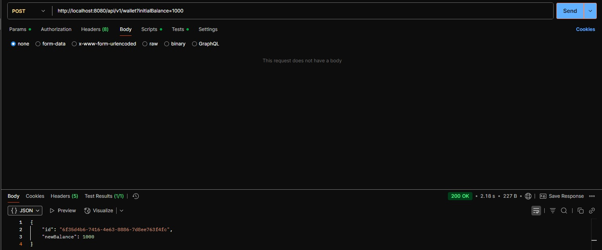

Напишите приложение, которое по REST принимает запрос вида
POST api/v1/wallet
{
valletId: UUID,
operationType: DEPOSIT or WITHDRAW,
amount: 1000
}
после выполнять логику по изменению счета в базе данных
также есть возможность получить баланс кошелька
GET api/v1/wallets/{WALLET_UUID}
стек:
java 8-17
Spring 3
Postgresql
Должны быть написаны миграции для базы данных с помощью liquibase
Обратите особое внимание проблемам при работе в конкурентной среде (1000 RPS по
одному кошельку). Ни один запрос не должен быть не обработан (50Х error)
Предусмотрите соблюдение формата ответа для заведомо неверных запросов, когда
кошелька не существует, не валидный json, или недостаточно средств.
приложение должно запускаться в докер контейнере, база данных тоже, вся система
должна подниматься с помощью docker-compose
предусмотрите возможность настраивать различные параметры как на стороне
приложения так и базы данных без пересборки контейнеров.
эндпоинты должны быть покрыты тестами.
Решенное задание залить на гитхаб, предоставить ссылку
Все возникающие вопросы по заданию решать самостоятельно, по своему
усмотрению.

Релизная версия по ТЗ:

Реализованы основные эндпоинты:
POST /api/v1/wallet - обработка операций DEPOSIT/WITHDRAW
GET /api/v1/wallets/{id} - получение баланса кошелька
Работа с БД:
PostgreSQL в Docker-контейнере
Миграции через Liquibase (create-wallet-table.yaml)
Тестирование:
Юнит-тесты для сервисов
Интеграционные тесты репозитория
Обработка ошибок:
Кастомные исключения (недостаточно средств, кошелек не найден)
Глобальный обработчик через @ControllerAdvice
Докеризация:
Полная контейнеризация (Dockerfile + docker-compose.yml)
Настройка через переменные окружения

Примечания:
Для нагрузочного тестирования 1000 RPS требуется серверная среда
Конкурентность обеспечена через @PESSIMISTIC_WRITE
Готово к развертыванию в production.

Примеры работы API (сохраняем ключ после создания кошелька):
Создаем кошелек:
POST http://localhost:8080/api/v1/wallet?initialBalance=1000

Ответ:
{
"id": "0bbe090c-6b9c-4eab-86ac-d42f205fbfbb",
"newBalance": 1000
}

Пополняем баланс:
POST http://localhost:8080/api/v1/wallet/balance
{
"id": "0bbe090c-6b9c-4eab-86ac-d42f205fbfbb",
"operationType": "DEPOSIT",
"amount": 10000.00
}

Ответ:
{
"id": "0bbe090c-6b9c-4eab-86ac-d42f205fbfbb",
"newBalance": 11000.00
}

Проверяем баланс:
GET http://localhost:8080/api/v1/wallet/wallets/0bbe090c-6b9c-4eab-86ac-d42f205fbfbb

Ответ:
{
"id": "0bbe090c-6b9c-4eab-86ac-d42f205fbfbb",
"newBalance": 11000.00
}

Снимаем деньги:
POST http://localhost:8080/api/v1/wallet/balance

{
"id": "0bbe090c-6b9c-4eab-86ac-d42f205fbfbb",
"operationType": "WITHDRAW",
"amount": 3000
}

Ответ:
{
"id": "0bbe090c-6b9c-4eab-86ac-d42f205fbfbb",
"newBalance": 8000.00
}

Пробуем снять больше, чем есть:
POST http://localhost:8080/api/v1/wallet/balance
{
"id": "0bbe090c-6b9c-4eab-86ac-d42f205fbfbb",
"operationType": "WITHDRAW",
"amount": 30000
}

Ответ:
{
"message": "Недостаточно средств на Вашем счёте."
}

