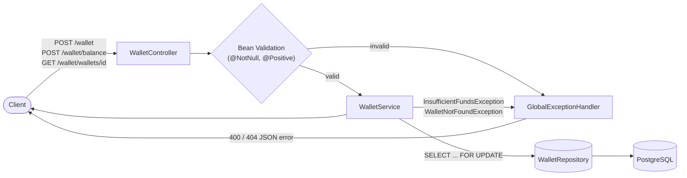
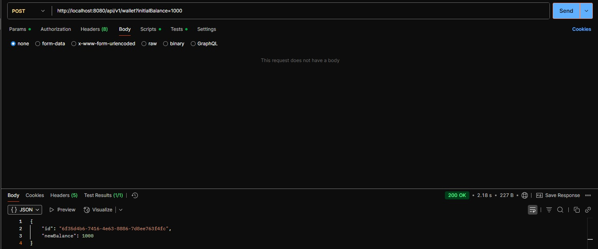
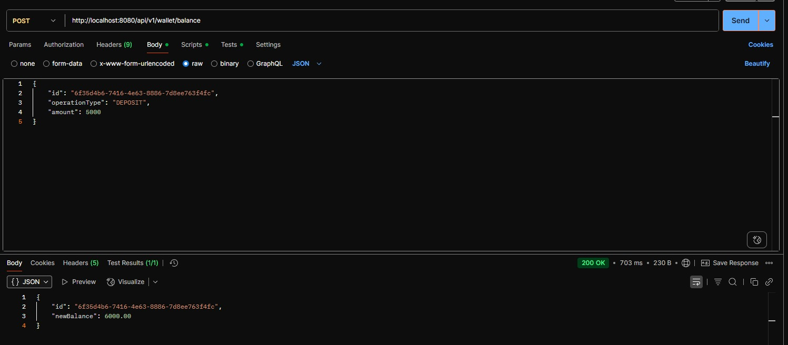
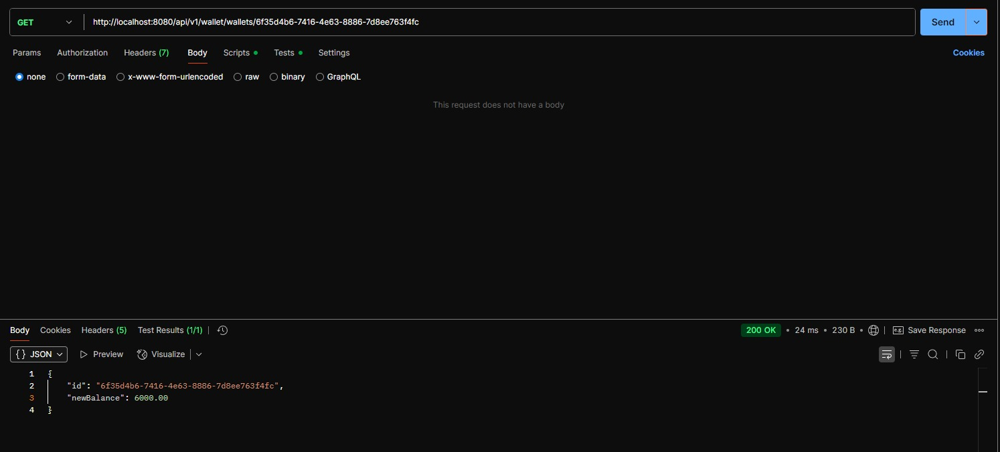
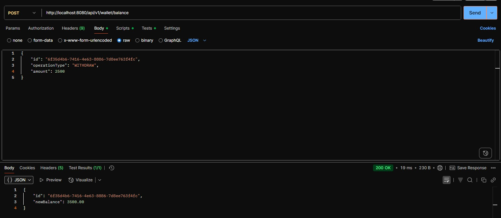
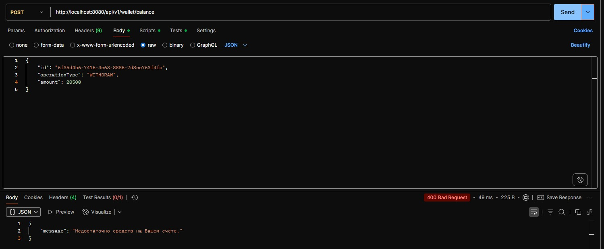

# High-Load Wallet Service

A REST service for managing wallet balances (`DEPOSIT` / `WITHDRAW`) built to stay correct under concurrent load on the same wallet — no lost updates, no 5xx on invalid input.


## Overview

Financial-style balance updates are a classic race-condition trap: two concurrent requests read the same balance, both compute their own new value, and one write silently overwrites the other. This service prevents that with row-level pessimistic locking (`SELECT ... FOR UPDATE`) on every balance mutation, verified under actual concurrent load rather than assumed correct.

## Tech Stack

- **Java 17**, **Spring Boot 3.5** (Web, Validation, Data JPA)
- **PostgreSQL 15**, schema migrations via **Liquibase**
- **Docker / Docker Compose** — fully containerized, config via env vars, no rebuild needed to change settings
- **JUnit 5 + Mockito** for controller/validation tests, **Testcontainers** for repository integration tests
- **[hey](https://github.com/rakyll/hey)** for load testing

## Architecture


```mermaid
flowchart LR
    Client([Client]) -->|POST /wallet<br/>POST /wallet/balance<br/>GET /wallet/wallets/id| Controller[WalletController]
    Controller --> Validation{"Bean Validation<br/>(@NotNull, @Positive)"}
    Validation -- invalid --> Handler[GlobalExceptionHandler]
    Validation -- valid --> Service[WalletService]
    Service -->|SELECT ... FOR UPDATE| Repo[(WalletRepository)]
    Repo --> DB[(PostgreSQL)]
    Service -- InsufficientFundsException<br/>WalletNotFoundException --> Handler
    Handler -->|400 / 404 JSON error| Client
    Service --> Client
```

## API

**Create a wallet**
```
POST /api/v1/wallet?initialBalance=1000
```
```json
{ "id": "0bbe090c-6b9c-4eab-86ac-d42f205fbfbb", "newBalance": 1000 }
```

**Deposit / Withdraw**
```
POST /api/v1/wallet/balance
{
  "id": "0bbe090c-6b9c-4eab-86ac-d42f205fbfbb",
  "operationType": "DEPOSIT",
  "amount": 10000.00
}
```
```json
{ "id": "0bbe090c-6b9c-4eab-86ac-d42f205fbfbb", "newBalance": 11000.00 }
```

**Get balance**
```
GET /api/v1/wallet/wallets/0bbe090c-6b9c-4eab-86ac-d42f205fbfbb
```
```json
{ "id": "0bbe090c-6b9c-4eab-86ac-d42f205fbfbb", "newBalance": 11000.00 }
```

**Insufficient funds**
```
POST /api/v1/wallet/balance
{ "id": "0bbe090c-6b9c-4eab-86ac-d42f205fbfbb", "operationType": "WITHDRAW", "amount": 30000 }
```
```json
{ "message": "Недостаточно средств на Вашем счёте." }
```







## Error Handling

| Condition | Status | Body |
|---|---|---|
| Malformed / unreadable JSON | 400 | `{"message": "Невалидный JSON"}` |
| Validation failure (`@NotNull`, `@Positive`) | 400 | `{"message": "<field>: <reason>"}` |
| Insufficient funds on withdrawal | 400 | `{"message": "Недостаточно средств на Вашем счёте."}` |
| Wallet not found | 404 | `{"message": "Кошелёк с ID <id> не найден"}` |
| Unexpected error | 500 | `{"message": "Внутренняя ошибка сервера"}` |

No request produces an unhandled 5xx — every failure mode above is explicitly caught in `GlobalExceptionHandler` and covered by `WalletControllerValidationTest`.

## Concurrency & Load Testing

Tested with `hey` against `POST /api/v1/wallet/balance`, which locks the target row (`PESSIMISTIC_WRITE`) for the duration of the update.

**Scenario 1 — single wallet, high contention** (50 concurrent clients, 2000 requests on one wallet)

| Metric | Value |
|---|---|
| Throughput | 148.77 req/s |
| p50 / p99 latency | 291 ms / 1.26 s |
| Failed requests | 0 |
| Final balance | exact match — no lost updates |

**Scenario 2 — 10 wallets, distributed load** (same 2000 requests, spread across 10 wallets)

| Metric | Value |
|---|---|
| Throughput | 377.25 req/s |
| Failed requests | 0 |
| Final balances | exact match on all 10 wallets |

Removing artificial single-row contention more than 2.5x'd throughput — confirming the lock serializes writes only to the same wallet, not the service as a whole. That's the correct behavior for a financial ledger.

Reproduce with:
```bash
./throughput_test.sh
```

## Running Locally

```bash
mvn clean package -DskipTests
docker compose up --build -d
```

App: `http://localhost:8080` · DB: `localhost:5432` (`wallet_db` / `wallet_user`)

Config is fully env-driven (see `docker-compose.yml`) — no rebuild needed to change datasource, credentials, or Liquibase behavior.

## Testing

```bash
mvn test
```

Covers: validation edge cases (`WalletControllerValidationTest`), service-layer unit tests, and repository integration tests via Testcontainers.